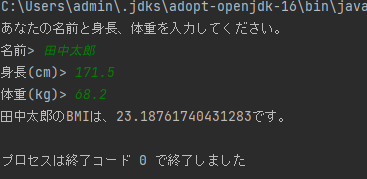

アプリプログラミング

## 第一週　課題提出

S21-033 直木 優

### 1.問題
以下の実行結果例のように、名前と身長と体重を入力して、BMI(Body Math Index)値を表示するプ
ログラムを作成しなさい。BMIとは、[体重(kg)]÷[身長(m)の2乗]で算出される値です。

### 2. ソースコード
```java
import java.util.Scanner;

public class Test1 {
    public static void main(String[] args) {
        Scanner stdIn = new Scanner(System.in);

        System.out.println("あなたの名前と身長、体重を入力してください。");
        System.out.print("名前> "); 
        String name = stdIn.next();
        System.out.print("身長(cm)> ");
        double cm = stdIn.nextDouble();
        System.out.print("体重(kg)> ");
        double kg = stdIn.nextDouble();

        System.out.println(name + "のBMIは、" + ((kg/(cm*cm))*10000) + "です。");
    }
}
```

### 3.実行結果



### 4.感想
　javaプログラミングは今まで習ってきたC言語と似ている部分もあるので混同しないよう気を付けたいと思います。