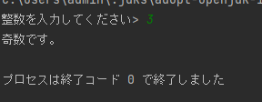

アプリプログラミング

##　第二週　課題提出

S21-033

### 1.問題
1. 整数を入力してすべての桁が奇数かそうでないかを調べるプログラムKadai2_1.javaを作成しなさ
   い。
2. 秒単位の時間Sを入力して、H:M:Sの形式で表示するプログラムKadai2_2.javaを作成しなさい。た
   だし、Sは60未満の秒、Mは60未満の分、Hは時間とします。
3. 1~30 までの整数を表示するプログラムKadai2_3.java作成しなさい。ただし、3 の倍数は *、5 の倍
   数は +、15 の倍数は @、それ以外は そのままの数を表示するものとします。

＃＃＃２．ソースコード

プログラム1.
```java
import java.util.Scanner;

public class Kadai2_1 {
public static void main(String[] args) {
Scanner stdIn = new Scanner(System.in);
        System.out.print("整数を入力してください> ");
        int n = stdIn.nextInt();

        if(n%2==1) {
            System.out.println("奇数です。");
        }
        else {
            System.out.println("奇数ではありません。");
        }
    }
}
```

プログラム2.
```java
```

プログラム3.
```java
```

### 3.実行結果
プログラム1.



プログラム2.


プログラム3.


### 4.感想
入力した秒数を分や時間に直すのが難しかったです。