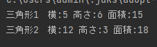

##　第四週　課題提出

S21-033　　直木 優

### 1.問題

1. 三角形を表すクラスTriangleを定義して、複数の具体的な三角形を扱うプログラムKdai4_1.javaを作
   成しなさい。
2. 円を表すクラスCircleを定義して、複数の具体的な円を扱うプログラムKdai4_2.javaを作成しなさ
   い。

###２．ソースコード

プログラム1.
```java
public class Triangle{
   int width;
   int height;

   Triangle(int width, int height){
      this.width = width;
      this.height = height;
   }

   public int getWidth(){
      return width;
   }
   public void setWidth(int width){
      this.width = width;
   }
   public int getHeight(){
      return height;
   }
   public void setHeight(int height){
      this.height = height;
   }
   public int getArea(){
      return (width * height) / 2;
   }
}
```
```java
public class Kadai4_1 {
    public static void main(String[] args) {
        Triangle t1 = new Triangle(5,6);
        Triangle t2 = new Triangle(12,3);

        System.out.println("三角形1　横:"+ t1.getWidth() +" 高さ:"+ t1.getHeight() +" 面積:"+ t1.getArea());
        System.out.println("三角形2　横:"+ t2.getWidth() +" 高さ:"+ t2.getHeight() +" 面積:"+ t2.getArea());
    }
}
```

プログラム2.
```java

```

### 3.実行結果
プログラム1.



プログラム2.


### 4.感想
二問目の問題のCircle()にwidthとheightを入力するところがわからなかったです。